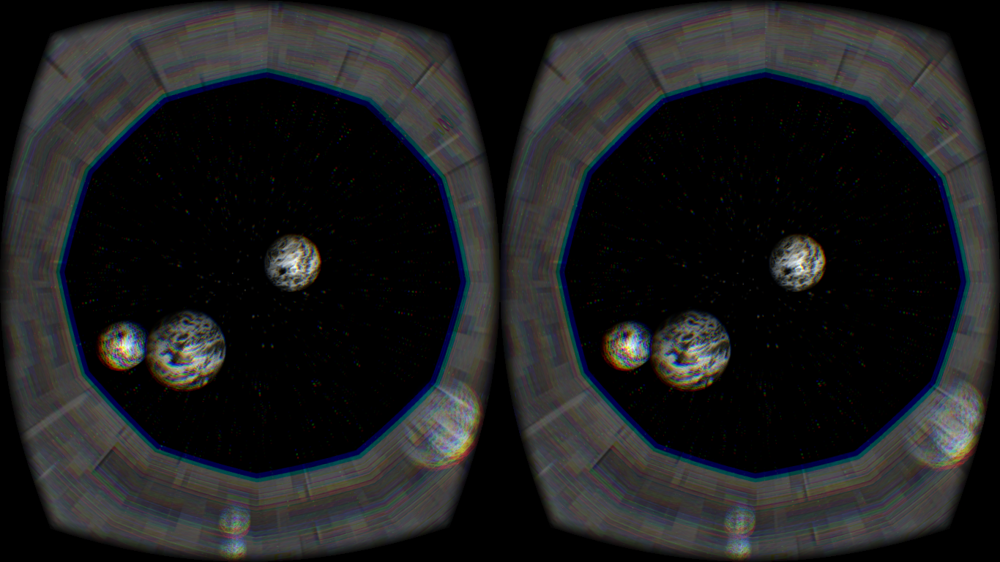

VR Planet Chase
===============
World's First browser-based virtual reality game!  [PLAY NOW](http://amberroy.github.io/vr-planet-chase/vrplanetchase.html)

Share link: http://VRplanetchase.com

This simple but ground-breaking WebVR game is implemented using Javascript and runs in a web browser, unlike Oculus Rift games built for PC or Mac using game engines like Unity3d.

###Requirements
#### WebVR Mode

1. Oculus Rift DK2 ([order from Oculus](https://www.oculus.com/order/))
2. Desktop or Laptop computer running:
  - Windows or Mac OS
  - Oculus Runtime ([download from Oculus](https://developer.oculusvr.com/))
  - VR-enabled build of Firefox Nightly ([download from Mozilla](http://blog.bitops.com/blog/2014/08/20/updated-firefox-vr-builds) v36)  
  or Chromium ([download from Google](https://drive.google.com/folderview?id=0BzudLt22BqGRbW9WTHMtOWMzNjQ&usp=sharing#list) v30)

#### Cardboard Mode
1. VR Viewer ([buy from DodoCase](http://www.dodocase.com/products/google-cardboard-vr-goggle-toolkit))
2. Android smartphone running:
  - WebGL enabled mobile browser, such as Google Chrome for Android 4+  
    See <a href="https://cardboard.withgoogle.com/">Google Cardboard FAQ</a> for list of compatible cell phones.  
    (iPhone not supported since Chrome full-screen not allowed on iOS 8)</ol>

###How To Play
####Navigate the asteroid field to reach the Red Planet!

> **Controls:**

> - **Forward** thrusters: Left mouse button *or* W key 
> - **Backward** thrusters: Center mouse button *or* S key  
> - Hold down the button to keep moving.
> - You will move in the direction you are looking.
> - **Cardboard Mode**: You will move forward automatically.  
If you run into an asteroid, turn around to reverse course.
     

To start the game, click the "VR" button at the top-left of the page, or press the Enter key.  This will put your browser into full-screen VR mode, and you may need to click "Allow" to confirm.  Be sure your Oculus Rift DK2 is connected to your computer, or else you will get the "No HMD found" error message. Alternatively, tap the "Cardboard" button and insert your smartphone into the viewer.

Once you get close enough to the Red Planet it will turn blue.  Congratulations!  Next you will be transported to a new galaxy, with a different asteroid field to explore and a new Red Planet to find.  The asteroid and planet positions are randomly generated, so the difficulty of your search will vary from one galaxy to the next; some will seem easier, some harder.

> **Tip:** The Red Planet might be hidden behind an asteroid, so if you don't spot it right away, move around and keep looking.

Note there is no "end" to the game, as it was designed to be used in a demo (or party!) situation, where users play for a few minutes than pass the Oculus Rift DK2 to the next player. VR Planet Chase can be played seated in front of your laptop or desktop computer, but is best enjoyed as a "standing VR" experience, with a wireless mouse as the input device (which can be held in your hand since only the buttons are used).

If you have questions, comments, or contributions please email VRplanetchase@gmail.com

**Credits**  
Game Programmer: Amber Roy  
Created on: October 18, 2014  
Special thanks to: [VR Hackathon](http://vrhackathon.com), [SFVR](http://www.meetup.com/virtualreality), [SVVR](http://svvr.com)

Copyright (c) Amber Roy 2014.  All rights reserved.  
